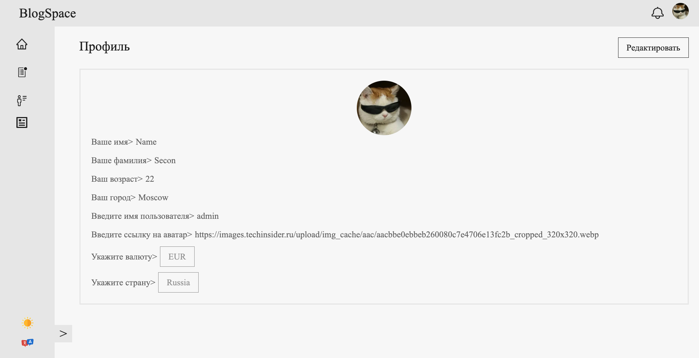
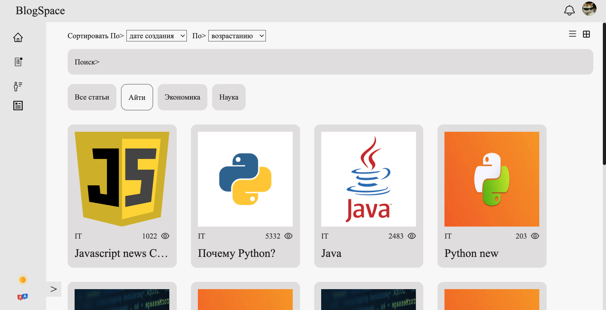
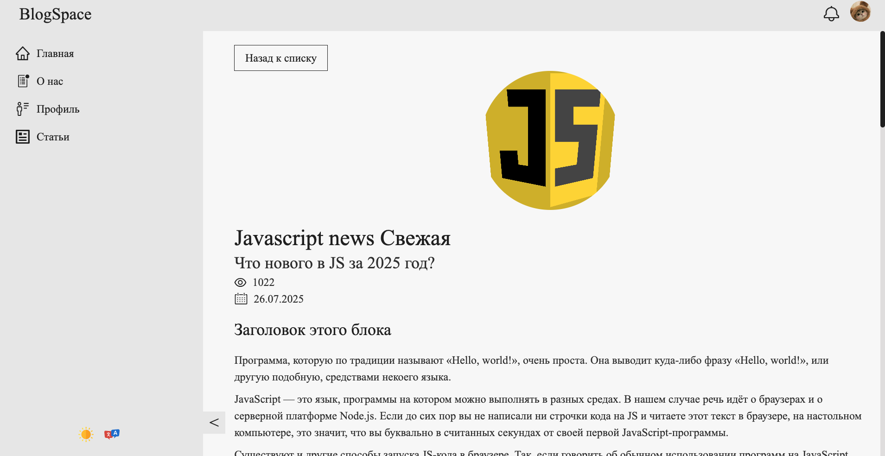
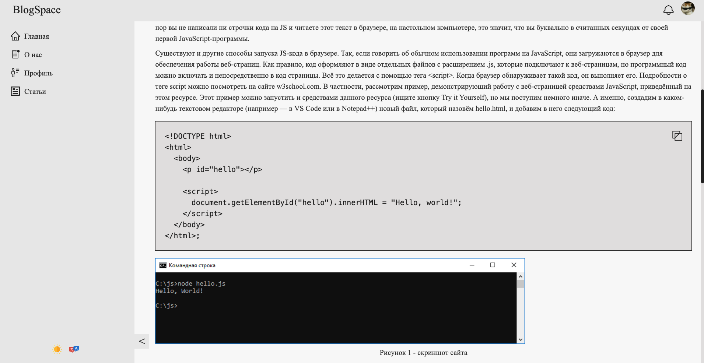
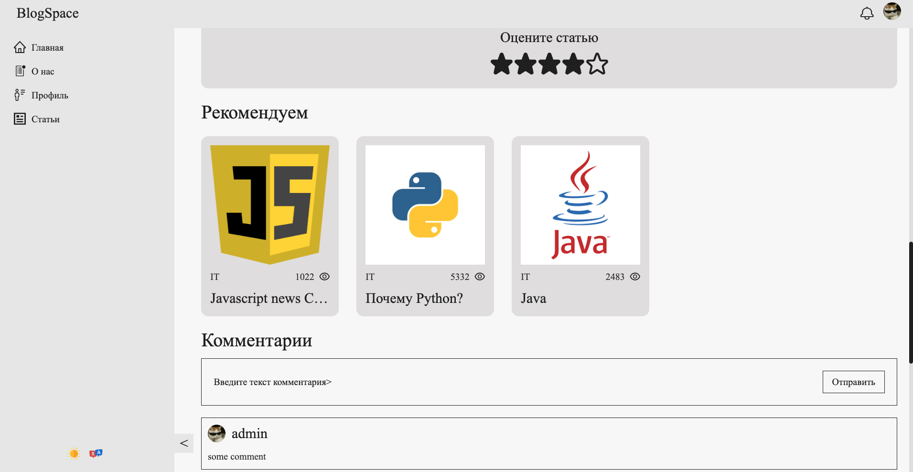

## 🖼 Скриншоты

### Страница профиля



### Страница со статьями



### Страница статьи







---

## Запус проекта

```
npm install - устанавливаем зависимости
npm run start:dev или npm run start:dev:vite - запуск сервера + frontend проекта в dev режиме
```

---

## Архитектура проекта

Проект написан в соответствии с методологией Feature sliced design

Ссылка на документацию - [feature sliced design](https://feature-sliced.design/docs/get-started/tutorial)

---

## Работа с переводами

В проекте используется библиотека i18next для работы с переводами.
Файлы с переводами хранятся в public/locales.

Для комфортной работы рекомендуем установить плагин для webstorm/vscode

Документация i18next - [https://react.i18next.com/](https://react.i18next.com/)

---

## Тесты

В проекте используются 3 вида тестов:

1. Обычные unit тесты на jest - `npm run test:unit`
2. Тесты на компоненты с React testing library -`npm run test:unit`
3. e2e тестирование с Cypress `npm run test:e2e`

Подробнее о тестах - [документация тестирование](/docs/tests.md)

---

## Линтинг

В проекте используется eslint для проверки typescript кода и stylelint для проверки файлов со стилями.

Также для строгого контроля главных архитектурных принципов
используется собственный eslint plugin _eslint-plugin-dzen-plugin_,
который содержит 3 правила

1. path-checker - запрещает использовать абсолютные импорты в рамках одного модуля
2. layer-imports - проверяет корректность использования слоев с точки зрения FSD
   (например widgets нельзя использовать в features и entitites)
3. public-api-imports - разрешает импорт из других модулей только из public api. Имеет auto fix

##### Запуск линтеров

-   `npm run lint:ts` - Проверка ts файлов линтером
-   `npm run lint:ts:fix` - Исправление ts файлов линтером
-   `npm run lint:scss` - Проверка scss файлов style линтером
-   `npm run lint:scss:fix` - Исправление scss файлов style линтером

---

## Конфигурация проекта

Для разработки проект содержит 2 конфига:

1. Webpack - ./config/build
2. vite - vite.config.ts

Оба сборщика адаптированы под основные фичи приложения.

Вся конфигурация хранится в /config

-   /config/babel - babel
-   /config/build - конфигурация webpack
-   /config/jest - конфигурация тестовой среды

В папке `scripts` находятся различные скрипты для рефакторинга\упрощения написания кода\генерации отчетов и тд.

---

## CI pipeline и pre commit хуки

Конфигурация github actions находится в /.github/workflows.
В ci прогоняются все виды тестов, сборка проекта и сторибука, линтинг.

В прекоммит хуках проверяем проект линтерами, конфиг в /.husky

---

### Работа с данными

Взаимодействие с данными осуществляется с помощью redux toolkit.
По возможности переиспользуемые сущности необходимо нормализовать с помощью EntityAdapter

Запросы на сервер отправляются с помощью [RTK query](/src/shared/api/rtkApi.ts)

Для асинхронного подключения редюсеров (чтобы не тянуть их в общий бандл) используется
[DynamicModuleLoader](/src/shared/lib/components/DynamicModuleLoader/DynamicModuleLoader.tsx)

---

## Сущности (entities)

-   [Article](/src/entities/Article)
-   [Comment](/src/entities/Comment)
-   [Country](/src/entities/Country)
-   [Currency](/src/entities/Currency)
-   [Notification](/src/entities/Notification)
-   [Profile](/src/entities/Profile)
-   [Rating](/src/entities/Rating)
-   [User](/src/entities/User)

## Фичи (features)

-   [addCommentForm](/src/features/addCommentForm)
-   [articleRating](/src/features/articleRating)
-   [articleRecommendationsList](/src/features/articleRecommendationsList)
-   [AuthByUsername](/src/features/AuthByUsername)
-   [avatarDropdown](/src/features/avatarDropdown)
-   [editableProfileCard](/src/features/editableProfileCard)
-   [LangSwitcher](/src/features/LangSwitcher)
-   [notificationButton](/src/features/notificationButton)
-   [ThemeSwitcher](/src/features/ThemeSwitcher)
-   [UI](/src/features/ScrollSave)

---

## Скрипты

-   `npm run start` - Запуск frontend проекта на webpack dev server
-   `npm run start:vite` - Запуск frontend проекта на vite
-   `npm run start:dev` - Запуск frontend проекта на webpack dev server + backend
-   `npm run start:dev:vite` - Запуск frontend проекта на vite + backend
-   `npm run start:dev:server` - Запуск backend сервера
-   `npm run build:prod` - Сборка в prod режиме
-   `npm run build:dev` - Сборка в dev режиме (не минимизирован)
-   `npm run lint:ts` - Проверка ts файлов линтером
-   `npm run lint:ts:fix` - Исправление ts файлов линтером
-   `npm run lint:scss` - Проверка scss файлов style линтером
-   `npm run lint:scss:fix` - Исправление scss файлов style линтером
-   `npm run test:unit` - Запуск unit тестов с jest
-   `npm run prepare` - прекоммит хуки
